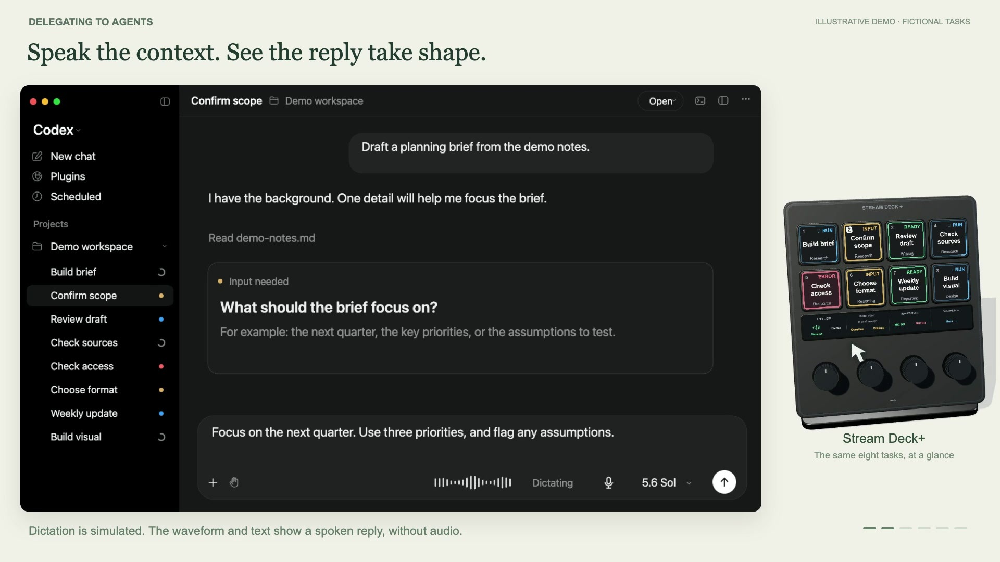
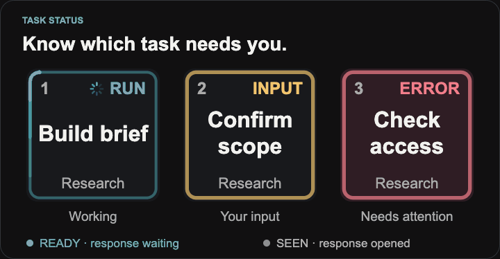
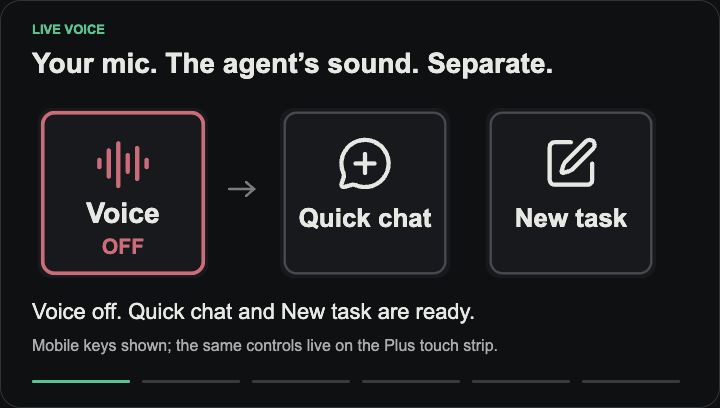
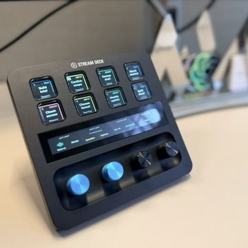
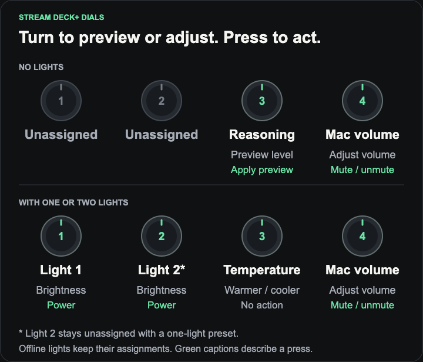
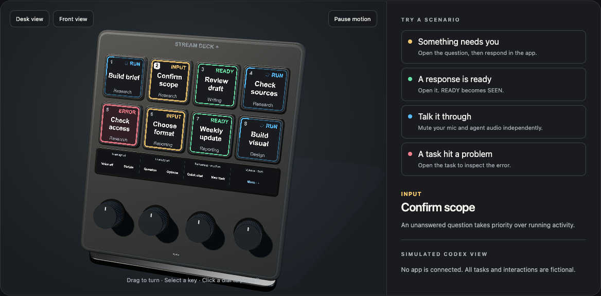

# Streamdex

An experiment in ways of working with agentic workflows, using Stream Deck+ and Mobile to keep Codex tasks in view and put common controls within reach.

Shared as an experimental snapshot. No support is provided, and there is no commitment to ongoing maintenance, updates, or compatibility fixes.

**[▶ Watch the 37-second walkthrough](docs/assets/streamdex-hero.mp4)** · **[Try the interactive demo locally](#try-it-without-hardware)** · [Setup](#set-up-with-your-local-agent)

The film uses fictional conversations and simulated interactions. Dictated replies are reviewed and sent in Codex. The hardware does not automatically answer questions or approve work.

> **Experimental candidate: v0.1.0-beta.1.** The source snapshot is public; a packaged beta release has not been published. Fresh downloaded installation, physical-device acceptance, and a nontechnical walkthrough remain release gates. See [verification status](docs/VERIFICATION.md).

## What is on the deck

Eight task cards show a title, project, and status. RUN is blue with motion; INPUT pulses amber; ERROR pulses red on a subtle red background; READY is green; SEEN is gray. An unanswered question takes priority over running activity. SEEN means the response was opened, not that it was reviewed or approved.

*Animation plays once. [View the static task-state guide](docs/assets/readme-status-still.png).*

Context controls follow the selected task. Approval and plan-start controls require a deliberate hold and a fresh, matching request. A hold approves only that specific request; it does not grant blanket permission. Change global permission settings inside Codex. Streamdex provides no Full Access switch or commit/push/deploy presets. Voice has separate microphone and agent-audio toggles (green when enabled, red when muted). When Voice ends, Quick chat and New task return to those positions. Dictation and Fast/Plan controls are available on both devices.

*Mobile keys shown; Stream Deck+ uses the touch strip. Animation plays once. [View the static Voice example](docs/assets/readme-voice-still.png).*

*The physical setup, photographed with fictional task labels. [Larger photo and layout guide](docs/HARDWARE.md).*

On Stream Deck+, the first page keeps all eight tasks together. The touch strip provides Voice/dictation, task actions, dynamic mic/audio controls, and More/Tasks navigation. Mobile uses a 5 × 3 layout with the same eight task cards; Fast and Plan live on More.

| Dial | With optional Elgato lights | Without lights |
|---|---|---|
| 1 | Light 1 brightness; press for power | Unassigned |
| 2 | Light 2 brightness/power, if configured | Unassigned |
| 3 | Configured lights’ color temperature | Preview reasoning; press to apply |
| 4 | Mac volume; press to mute | Same |

A configured light going offline keeps its assignment. Reasoning previews expire and are tied to the same task and model. Spotify and meeting controls are outside this first release.

## Try it without hardware

Open **[docs/demo/index.html](docs/demo/index.html)** from a downloaded copy in your browser. Select tasks, open a question, mark a response seen, toggle Voice audio, and try the dial presets. The page includes keyboard-accessible controls, reduced motion, pause/reset, and a fallback when WebGL is unavailable. It uses no accounts, microphones, live tasks, analytics, or external libraries loaded over the network.

GitHub cannot execute this demo inside a README. The planned public demo address is `https://danielsack.github.io/streamdex/demo/`, which will only be enabled after publication review. Until then, run the local file or a local static server.

## Set up with your local agent

The kit includes prebuilt Apple Silicon components. You do not need Node or Xcode to install it.

1. Download and unzip the **reviewed setup kit** once a release is available (the staged candidate can be reviewed locally now).
2. Open its folder in Codex, or another agent session with local filesystem and terminal access. A web-only or cloud session cannot install hardware software on your Mac.
3. Paste this prompt:

> Read AGENTS.md and docs/INSTALL.md. Inspect this Streamdex kit and my local compatibility without changing anything first. Verify its checksums, explain the result, and help me install it using the normal Stream Deck installer. Ask whether I want zero, one, or two Elgato lights. Preserve my current setup and backups. Stop if the documented release gates or integrity checks are not satisfied. Do not bypass macOS security or organizational restrictions.

The setup helper supports `inspect`, `install`, `verify`, and `rollback`. It uses the separate `io.streamdex.plugin` plugin identity, backs up only affected Streamdex files, and leaves other plugins and profiles alone. Repeated installation of the same build is a no-op.

See **[installation and rollback](docs/INSTALL.md)** for commands, lighting configuration, normal macOS approval prompts, and recovery. Read acknowledgements and configuration are stored in your user Application Support folder, outside the distributed plugin.

## Compatibility and limits

The first candidate targets **macOS on Apple Silicon**, **English Codex UI**, **Stream Deck 7.1 or later**, and Stream Deck+ or a **15-button Mobile layout**. Mobile may require an Elgato entitlement for that layout. The actual tested-version matrix and outstanding checks are in [VERIFICATION.md](docs/VERIFICATION.md).

This setup reads local Codex state and uses macOS Accessibility for visible app controls. Codex UI or database changes can require updates. Unknown, stale, ambiguous, and locked-screen states must fail closed. The installer and prebuilt helpers are experimental builds, not Apple Developer ID notarized applications. Use only the normal macOS approval process; inability to install that way is a release blocker.

## Privacy in everyday use

Task and project titles appear on the physical deck and on Mobile. Treat those screens like your Codex window when sharing a desk, presenting, or taking screenshots. The public demo and photos use fictional tasks to illustrate the experiment.

Streamdex reads local task state and controls the app on your Mac. This does not make Codex’s AI processing offline or change its account, retention, permission, or organization settings. Use it only where those settings and the required Accessibility access are appropriate. Voice mic and speaker buttons affect the Codex Voice session, not meeting apps or the Mac’s microphone permissions. See [data handling and privacy](docs/PRIVACY.md).

## Source and credit

Streamdex is an experiment by **Daniel Sack ([@danielsack](https://github.com/danielsack))** and is based on **Todd Dailey’s [streamdeckcodex](https://github.com/twidtwid/streamdeckcodex)**. The upstream task tracking, command bridge, and native targeting work form its foundation. Streamdex adds the task-card design, Mobile/Plus layouts, Voice controls, persistent read state, lighting presets, setup kit, and demo.

[MIT license](LICENSE) · [Third-party notices](THIRD_PARTY_NOTICES.md) · [Source and build guide](docs/BUILD.md) · [Privacy review](docs/PRIVACY.md)

This is a personal, independent experiment, provided as is under the MIT license. It does not represent an employer and is not an official OpenAI or Elgato product. No organizational endorsement is implied.
