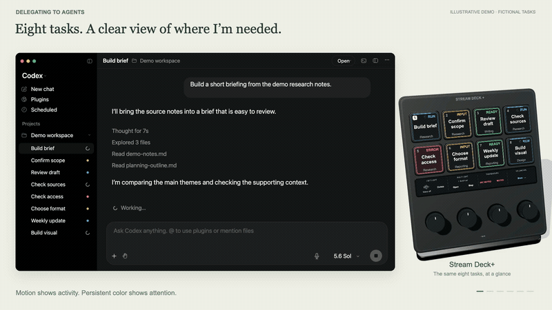

# Streamdex

I built Streamdex to experiment with how I work with AI agents. It puts eight Codex tasks on a Stream Deck+ or phone, so I can see what's running and which tasks need me, then jump into the conversation.

I'm sharing the setup and the ideas behind it. If some of it is useful for your own workflow, great.

<a href="https://danielsack.github.io/streamdex/demo/#walkthrough">
  <picture>
    <source media="(prefers-reduced-motion: reduce)" srcset="docs/assets/hero-poster.jpg">
    
  </picture>
</a>

*Five-second preview plays once. [Static preview](docs/assets/hero-poster.jpg).*

**[Watch the walkthrough](https://danielsack.github.io/streamdex/demo/#walkthrough)** (37 seconds, 1.4 MB) · **[Try the demo](https://danielsack.github.io/streamdex/demo/)** · **[Setup](#setup)**

## What is on the deck

Each card shows a task title, project, and status. Running tasks have a moving blue border; questions pulse amber and errors pulse red. Green means a new response is ready. Gray means you've opened it.

*Animation plays once. [Static task-state guide](docs/assets/readme-status-still.png).*

The controls follow the selected task. Open its conversation or output, dictate a reply, or hold a control to approve the current request or start a plan. Dictation creates a draft that you review and send in Codex.

Voice has separate microphone and speaker buttons: green when enabled, red when muted. When Voice ends, those controls switch back to Quick chat and New task.

*Mobile keys shown; Stream Deck+ uses the touch strip. [Static Voice example](docs/assets/readme-voice-still.png).*

*My Stream Deck+ setup. [Larger photo and layout guide](docs/HARDWARE.md).*

On Stream Deck+, all eight tasks stay on the first page. The touch strip handles Voice, dictation, task actions, and navigation. Mobile uses a 5 × 3 layout, with Fast and Plan on the More page.

The dials handle volume and optional Elgato lights. Without lights, the third dial lets you preview a reasoning level and press to apply it to the selected task.

| Dial | With Elgato lights | Without lights |
|---|---|---|
| 1 | Light 1 brightness; press for power | Unassigned |
| 2 | Light 2 brightness/power, if configured | Unassigned |
| 3 | Light color temperature | Preview reasoning; press to apply |
| 4 | Mac volume; press to mute | Same |

## Try it without hardware

**[Open the interactive demo](https://danielsack.github.io/streamdex/demo/)** in your browser. Turn the model, select a task, open a question, and try the Voice controls or dial presets. Keyboard controls, pause/reset, and reduced motion are available too. No installation or sign-in is needed; the demo does not connect to Codex or use your microphone.

For offline use, download this repository and open `docs/demo/index.html`.

## Setup

The source, profiles, and prebuilt components are in this repository. There isn't a published beta release yet. The [version and testing notes](docs/VERIFICATION.md) describe what has been checked.

The setup targets **Apple Silicon Macs**, **English Codex UI**, **Stream Deck 7.1 or later**, and either Stream Deck+ or a **15-button Mobile layout**. Stream Deck Mobile may require an entitlement for that layout.

Start with the [installation guide](docs/INSTALL.md), which covers inspection, permissions, lights, backups, and rollback. To work through it with a local agent, open the downloaded folder in Codex and paste:

> Read AGENTS.md and docs/INSTALL.md. Check whether this kit is ready to install on my Mac, verify its checksums, and walk me through the setup. Ask whether I use zero, one, or two Elgato lights. Back up my existing setup and show me how to roll back. Use the normal Stream Deck and macOS installation prompts.

The setup helper provides `inspect`, `install`, `verify`, and `rollback`. It preserves unrelated profiles and keeps your settings and read acknowledgements outside the plugin. For changes to the code, see the [build guide](docs/BUILD.md).

## A note on privacy

Task and project titles appear on your deck or phone, so check what's visible before sharing photos or recordings. Streamdex reads local Codex state and uses macOS Accessibility to operate its controls. Codex's usual account and data settings still apply, including for Voice. The [privacy guide](docs/PRIVACY.md) explains the details.

## Contributing

The [contribution guide](CONTRIBUTING.md) covers local checks, branches, and pull requests. PRs run the build and tests on GitHub Actions.

## Source and credit

Streamdex is a personal experiment by **Daniel Sack ([@danielsack](https://github.com/danielsack))**, built on **Todd Dailey's [streamdeckcodex](https://github.com/twidtwid/streamdeckcodex)**. Todd's task tracking, command bridge, and native targeting form the foundation. Streamdex adds the task-card design, Mobile/Plus layouts, Voice controls, persistent read state, lighting presets, setup kit, and demo.

[MIT license](LICENSE) · [Third-party notices](THIRD_PARTY_NOTICES.md) · [Build guide](docs/BUILD.md) · [Changelog](CHANGELOG.md)
