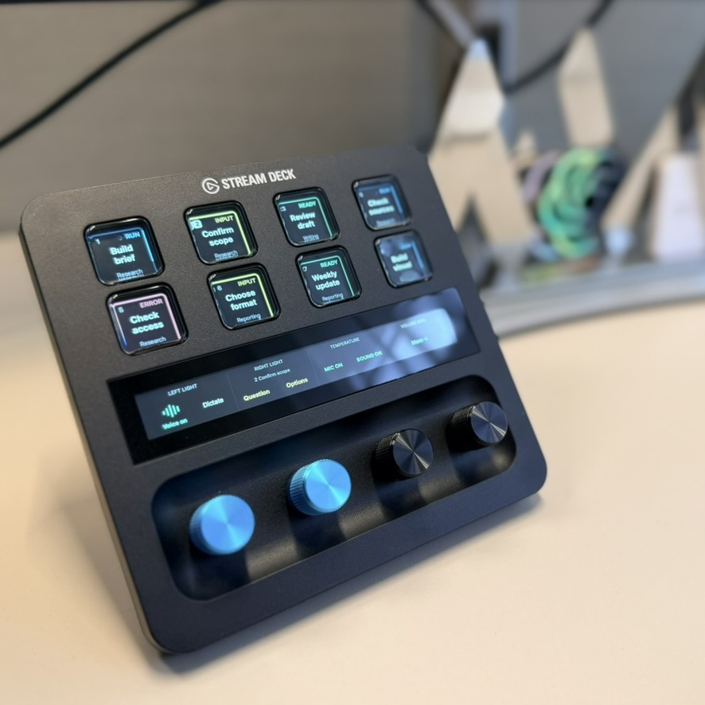

# Streamdex on the desk

[Back to the README](../README.md)

This owner-supplied photograph shows the physical setup with fictional task and project names. It illustrates readability and placement; it does not certify acceptance of this beta candidate or an organizational deployment. The public copy has no embedded photo metadata.

## Reading the controls

- **Task keys:** select a task by its title and project. The status word accompanies the color: blue RUN, amber INPUT, red ERROR, green READY, and gray SEEN. SEEN records that a response was opened, not that its work was approved. Animation and the red error background are easier to see in the [interactive demo](https://danielsack.github.io/streamdex/demo/).
- **Touch strip:** Voice and dictation, actions for the selected task, contextual microphone/speaker controls, and page navigation. When Voice is inactive, Quick chat and New task take the audio-control positions. Mic and sound toggle independently for the Codex Voice session.
- **Dials:** optional light brightness/power on the first two; temperature on the third when lights are configured. Without lights, the third previews reasoning and applies it on press to the verified task without changing its model. The fourth controls Mac volume and mute.

Mobile uses the same task/status language in a 15-button layout. Its Voice mic/speaker controls are keys; Fast and Plan are on More. A photo cannot demonstrate dynamic controls or physical-device reliability. See the [current verification matrix and outstanding checks](VERIFICATION.md) before installation.

Task titles are visible to anyone who can see the device. Use fictional tasks for public demonstrations and follow the [privacy guidance](PRIVACY.md) when sharing an image of your own setup.
